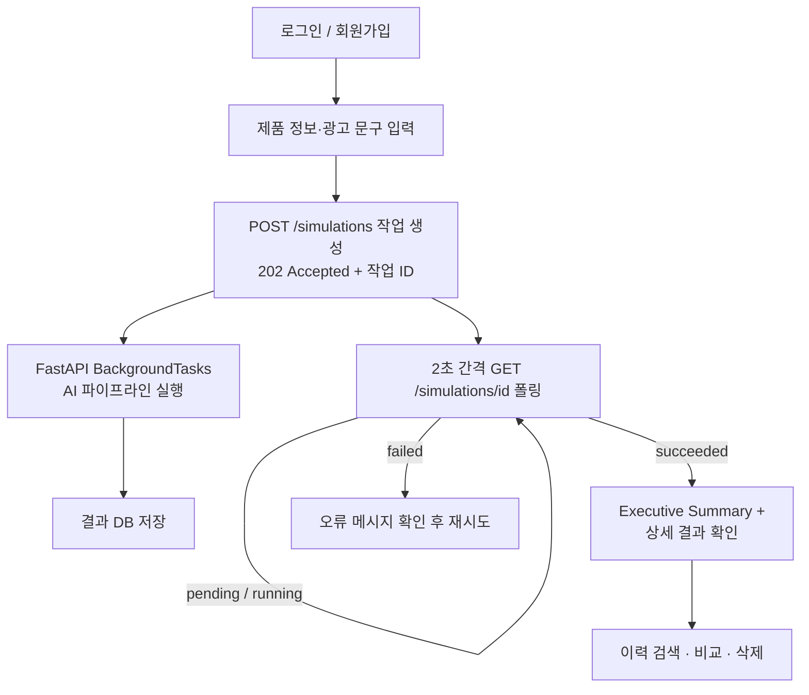
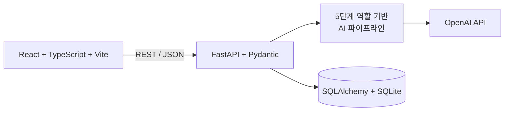
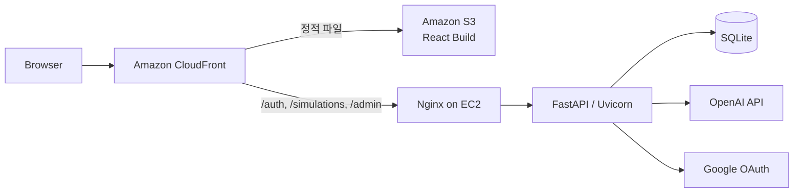
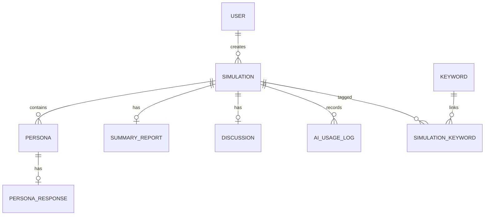

# AI Simulation Focus Group

> 제품 출시 전 소비자 관점의 반응을 검토하는 AI 시뮬레이션 서비스

- **Live Demo**: [https://d1nbjwbde2p4nn.cloudfront.net](https://d1nbjwbde2p4nn.cloudfront.net)
- **Test Account**: `test@naver.com` / `test1234` (일반 사용자 계정)
- **프로젝트 유형**: 개인 프로젝트 · 1인 개발 (기획, UI/UX, 프론트엔드, 백엔드, DB 설계, AI 파이프라인, 테스트, 배포 전 영역 단독 수행)

> AI 응답 생성에는 수십 초가 걸릴 수 있습니다. 시뮬레이션 요청 직후 작업 ID가 발급되고, 화면에서 진행 상태를 확인할 수 있습니다.

---

## 프로젝트 소개

실제 소비자 인터뷰나 Focus Group 조사는 준비와 섭외에 시간과 비용이 들기 때문에, 초기 아이디어 단계에서 가설을 빠르게 검토하기 어렵습니다.

이 프로젝트는 제품 정보와 광고 문구를 입력하면, 서로 다른 특성을 가진 가상 소비자 페르소나 10명의 반응·구매 의향·구매 장벽과 대표 소비자 간 그룹 토론, 개선 과제를 생성해주는 AI 시뮬레이션 도구입니다.

**이 서비스는 실제 소비자 조사를 대체하거나 구매 결과를 예측·보장하지 않습니다.** 본 조사를 시작하기 전 소비자 관점의 가설과 질문을 좁히는 보조 도구로 사용하는 것을 목표로 합니다.

## 주요 기능

- 제품명·제품 설명·타깃 고객·광고 문구 입력
- 제품 핵심 가치·예상 구매 동기·저항 요소·경쟁 대안 분석
- 서로 다른 특성을 가진 가상 소비자 페르소나 10명 생성
- 페르소나별 첫인상, 긍정 요소, 우려 사항, 구매 의향 점수(1~10) 분석
- Moderator 종합 리포트(핵심 인사이트, 개선 우선순위, 다음 액션)
- 구매 의향 상/중/하위 페르소나로 구성된 대표 소비자 그룹 토론과 의견 변화 시뮬레이션
- Executive Summary(종합 점수, 구매 의향 분포, 핵심 장벽, 우선 개선 과제 요약)
- 시뮬레이션 결과 저장·검색·상세 조회·삭제·실패 작업 재시도
- 최대 3개 결과 비교
- 제품 설명·광고 문구 기반 키워드 인사이트(긍정·부정 언급, 평균 구매 의향)
- 이메일 회원가입/로그인 + Google OAuth 로그인
- USER/ADMIN 역할 기반 권한 관리 및 관리자 대시보드
- AI 모델·토큰 사용량·실행 시간 기록

## 사용자 흐름



## AI 에이전트 파이프라인

5개의 역할 기반 에이전트가 **고정된 순서로 한 번씩 순차 실행**되며, 각 단계의 출력이 다음 단계의 입력으로 전달됩니다. 스스로 다음 행동을 계획하는 Planner, 도구를 자율 선택하는 Tool Calling, 세션 간 기억을 유지하는 장기 Memory, 자율적으로 반복 실행하는 기능은 없습니다 — **자율형 AI Agent가 아니라 5단계 역할 기반 Multi-Agent Pipeline**입니다.

| 단계 | 에이전트 | 역할 | 입력 | 출력 |
|---|---|---|---|---|
| 1 | ProductAnalyzerAgent | 제품 가치제안·구매동기·저항요소·경쟁대안 분석 | 제품 정보(제품명/설명/타깃/광고문구) | `ProductAnalysis` |
| 2 | PersonaGeneratorAgent | 서로 다른 특성의 가상 소비자 페르소나 10명 생성 | 제품 정보 + 1단계 분석 결과 | `Persona` 목록 (10명) |
| 3 | ConsumerResponseAgent | 페르소나별 첫인상·긍정 요소·우려·구매 의향 생성 | 페르소나 10명 + 제품 정보 + 분석 결과 | `PersonaResponse` 목록 |
| 4 | ModeratorAgent | 전체 반응을 종합한 리포트 생성 | 페르소나 + 전체 반응 | `SummaryReport` |
| 5 | DiscussionAgent | 구매 의향 점수 기준 대표 페르소나 5~6명의 그룹 토론 시뮬레이션 | 대표 페르소나 + 제품 정보 + Moderator 리포트 | `DiscussionResult` |

(근거: `backend/app/services/simulation_service.py`, `backend/app/agents/*.py`)

각 단계는 OpenAI Chat Completions API를 JSON 응답 형식으로 직접 호출하며, 실패 시 재시도(지수 백오프)·타임아웃을 적용하고, 응답이 비어있거나 파싱에 실패해도 기본값으로 정규화해 파이프라인이 중단되지 않도록 처리합니다. (`backend/app/agents/base.py`)

## 시스템 아키텍처



### 배포 구조



CloudFront가 경로 기반으로 정적 프론트엔드(S3)와 API(EC2)를 하나의 HTTPS 도메인에서 함께 제공합니다.

> **확인 범위**: Amazon S3·CloudFront·EC2 구성과 Live Demo 서비스 자체는 실제로 배포되어 동작 중입니다. 다만 Nginx 리버스 프록시와 systemd 프로세스 관리는 EC2 서버에 직접 구성된 운영 설정으로, 해당 설정 파일은 이 저장소에 포함되어 있지 않아 코드로는 검증할 수 없습니다.

## 데이터베이스

SQLite를 SQLAlchemy ORM + Alembic 마이그레이션으로 관리합니다. (`backend/app/db.py`, `backend/app/models/simulation.py`)



| 테이블 | 역할 |
|---|---|
| `users` | 이메일, 비밀번호 해시, 인증 제공자, 역할(USER/ADMIN) |
| `simulations` | 입력값, 작업 상태, 제품 분석 결과, 실행 시각, 오류 메시지 |
| `personas` | 시뮬레이션별 페르소나 프로필(JSON) |
| `persona_responses` | 페르소나별 반응·구매 의향(JSON) |
| `summary_reports` | Moderator 종합 리포트(JSON) |
| `discussions` | 그룹 토론 결과(JSON) |
| `keywords` | 키워드, 카테고리, 동의어 |
| `simulation_keywords` | 시뮬레이션-키워드 N:M 연결 |
| `ai_usage_logs` | 에이전트별 모델명, 토큰 수, 실행 시간, 시도 횟수, 성공/실패 상태 |

- `simulations.user_id` 외래키(`ON DELETE CASCADE`)로 사용자별 데이터 소유권을 분리하고, 사용자 삭제 시 관련 데이터가 함께 삭제됩니다.
- 시뮬레이션 삭제 시 `personas`, `persona_responses`, `summary_reports`, `discussions`가 CASCADE로 함께 삭제됩니다.
- `personas`는 `(simulation_id, persona_number)` 조합에 `UniqueConstraint`가 걸려 있습니다.
- `users.email`, `users.google_id`, `keywords.value`, `ai_usage_logs.simulation_id`에 인덱스/유니크 제약이 있습니다.
- AI JSON 응답은 관계형 컬럼이 아닌 각 테이블의 `JSON` 컬럼에 저장되어, 스키마 유연성과 조회 편의성을 함께 확보합니다.

## 인증과 권한

- 이메일 회원가입/로그인, 비밀번호는 PBKDF2(240,000회 반복)로 해시 (`backend/app/security.py`)
- JWT는 서드파티 라이브러리 없이 HMAC-SHA256으로 직접 구현한 서명 토큰이며, 만료 시각을 검증합니다.
- Google OAuth 2.0 로그인이 코드로 연동되어 있으며, `GOOGLE_CLIENT_ID`가 설정되지 않으면 503을 반환합니다. (`backend/app/api/auth.py`)
- `require_admin` 의존성으로 관리자 전용 API를 보호하며, 일반 사용자가 접근하면 403을 반환합니다. (`backend/app/api/admin.py`)
- 모든 시뮬레이션 조회/상세/삭제 API는 요청자의 `user_id`와 데이터 소유자를 비교해, 다른 사용자의 결과는 404로 응답합니다. (`backend/app/api/simulation.py`)
- 마지막 남은 관리자 계정의 권한을 USER로 낮추는 요청은 차단됩니다. (`backend/app/api/admin.py`)

**현재 구현의 한계**: JWT는 `localStorage`에 저장되어 있어 HttpOnly Cookie 방식보다 XSS에 취약할 수 있고, 토큰 폐기(revocation) 목록이나 리프레시 토큰 로테이션은 구현되어 있지 않습니다.

## 핵심 문제 해결

### 1. CloudFront 504 Gateway Timeout

- **문제**: 시뮬레이션 요청 시 CloudFront가 504 Gateway Timeout을 반환
- **원인**: 5단계 AI 호출이 순차로 끝날 때까지 하나의 HTTP 요청을 동기적으로 유지하는 구조였음
- **해결**: `POST /simulations`가 작업 생성 즉시 `202 Accepted`와 작업 ID를 반환하도록 변경하고, FastAPI `BackgroundTasks`로 AI 파이프라인 실행을 분리. 프론트엔드는 2초 간격으로 상태를 폴링하며 `pending → running → succeeded/failed`를 표시
- **결과**: 브라우저와 CloudFront가 AI 처리 시간만큼 요청을 유지할 필요가 없어졌고, 실패한 작업은 상태와 오류 메시지가 DB에 남아 재시도 가능

### 2. HTML 오류 응답을 JSON으로 파싱하려던 문제

- **문제**: CloudFront가 반환한 HTML 오류 페이지를 프론트엔드가 JSON으로 파싱하며 `Unexpected token '<'` 오류 발생
- **원인**: 응답의 Content-Type을 확인하지 않고 항상 `response.json()`을 호출
- **해결**: 응답의 `content-type` 헤더를 먼저 확인해, JSON이 아니면 상태 코드 기반의 별도 오류 메시지를 반환하는 `readJson`/`apiError` 헬퍼로 교체 (`frontend/src/services/simulationApi.ts`)

### 3. 로컬·배포 환경 CORS 문제

- **문제**: 로컬 개발 서버(`localhost:5173`)와 배포된 CloudFront 프론트엔드가 동시에 API를 호출할 때 CORS 오리진이 하나만 허용되면 나머지가 차단됨
- **해결**: 콤마로 구분된 `CORS_ORIGINS` 환경변수를 파싱한 뒤, 로컬 URL과 `FRONTEND_URL`을 항상 자동으로 포함하도록 정규화 (`backend/app/config.py`)

### 4. AI 응답 누락 및 JSON 파싱 실패

- **문제**: OpenAI 응답이 비어있거나 JSON 파싱에 실패하면 파이프라인 전체가 예외로 중단됨
- **해결**: 각 에이전트 응답을 Pydantic 스키마로 검증하고, 실패 시 빈 값으로 폴백하는 정규화 함수(`_normalize_analysis`, `_normalize_persona` 등)를 두어 항상 동일한 키 구조를 보장. 요청 단위 재시도(지수 백오프)와 타임아웃도 함께 적용 (`backend/app/agents/base.py`, `backend/app/agents/*.py`)

## 최종 리포트 UX

- **Executive Summary**: 종합 점수, 구매 의향 분포(높음/보통/낮음 비율), 가장 강한 긍정 요소, 가장 큰 구매 장벽, 최적 타깃, 우선 개선 과제를 결과 화면 최상단에 요약 (`ExecutiveSummary.tsx`)
- Moderator 리포트, 그룹 토론, 페르소나별 반응을 `<details>` 기반 접기/펼치기로 구성해 필요한 부분만 선택적으로 확인 가능 (`SimulationPage.tsx`)
- 페르소나 카드 내부의 상세 정보(거주지·자주 쓰는 앱 등)도 "추가 정보 보기"로 접어서 핵심 반응에 먼저 집중되도록 구성 (`PersonaCard.tsx`)
- 그룹 토론의 구매 의향 전/후 점수를 화살표로 연결하고 상승은 초록, 하락은 빨강으로 강조 (`DiscussionCard.tsx`)
- 찬성/지지/의견변화는 초록, 반대/반박은 빨강 배지로 표시해 긍정·부정 반응을 색상으로 구분 (`style.css`)

## 기술 스택

| 구분 | 기술 |
|---|---|
| Frontend | React, TypeScript, Vite, Fetch API |
| Backend | Python, FastAPI, Uvicorn, Pydantic |
| AI | OpenAI API, 5단계 역할 기반 Multi-Agent Pipeline, JSON 응답 검증, 재시도/타임아웃 처리 |
| Database | SQLite, SQLAlchemy ORM, Alembic Migration |
| Authentication | JWT(자체 구현), PBKDF2 비밀번호 해시, Google OAuth 2.0, RBAC |
| Infrastructure | Amazon S3, Amazon CloudFront, Amazon EC2 |
| Test | pytest, httpx (TypeScript 컴파일 + Vite 프로덕션 빌드로 프론트엔드 검증) |

## 테스트

**백엔드** (`cd backend && pytest -q`, 직접 실행 결과)

```text
12 passed
```

테스트 범위: 이메일 회원가입/로그인/JWT 인증, 관리자 API RBAC(401/403), 비동기 작업 생성 및 상태 전환(pending → running → succeeded/failed), 시뮬레이션 상세 조회·삭제·재시도, 다른 사용자의 시뮬레이션 접근 차단(404).

**프론트엔드** (`cd frontend && npm run build`, 직접 실행 결과)

```text
tsc && vite build
✓ 29 modules transformed
✓ built in 0.3s
```

TypeScript 컴파일과 Vite 프로덕션 빌드가 오류 없이 성공했습니다. Vitest/React Testing Library 기반 프론트엔드 자동 테스트는 아직 구현되어 있지 않습니다(`package.json`에 테스트 스크립트 없음).

## 로컬 실행 방법

### 요구 사항

- Python 3.10 이상, Node.js 18 이상, npm
- OpenAI API Key (Google OAuth는 선택 사항)

### Backend

```bash
cd backend
python -m venv venv
# Windows: venv\Scripts\Activate.ps1  /  macOS·Linux: source venv/bin/activate
pip install -r requirements.txt
cp .env.example .env   # 값을 채운 뒤 사용
alembic upgrade head
uvicorn app.main:app --reload --port 8000
```

### Frontend

```bash
cd frontend
npm install
cp .env.example .env
npm run dev
```

- Frontend: http://localhost:5173
- Backend: http://localhost:8000
- Swagger UI: http://localhost:8000/docs

필요한 환경변수 이름은 `backend/.env.example`, `backend/.env.production.example`, `frontend/.env.example`을 참고하세요. 실제 API 키, JWT Secret, OAuth Secret 값은 이 문서에 포함되어 있지 않습니다.

## 배포 구조

- **Amazon S3**: React 프로덕션 빌드 산출물 호스팅
- **Amazon CloudFront**: HTTPS 및 CDN, 경로 기반으로 S3(정적 파일)와 EC2(API)를 하나의 도메인에서 라우팅
- **Amazon EC2**: FastAPI(Uvicorn) 애플리케이션 서버
- **Nginx / systemd**: README와 배포 경험상 EC2에 구성되어 있으나, 해당 설정 파일은 이 저장소에 포함되어 있지 않아 코드로 검증할 수 없습니다.
- 이 저장소에는 Dockerfile이나 Docker Compose 설정이 없으며, 컨테이너 기반 배포는 사용하지 않았습니다.

## 현재 한계와 개선 방향

- FastAPI `BackgroundTasks`만으로 비동기 작업을 처리하므로, 서버 재시작 시 진행 중이던 작업이 복구되지 않습니다.
- Redis/Celery/SQS 같은 영속 작업 큐를 사용하지 않아, 프로세스 단위 장애에 취약합니다.
- SQLite는 다중 쓰기 요청 시 동시성 한계가 있어, 트래픽이 늘어나면 PostgreSQL 전환이 필요합니다.
- Vitest/React Testing Library 기반 프론트엔드 자동 테스트가 없습니다.
- TanStack Query 등 서버 상태 캐싱이 없어, 화면 전환 시 매번 새로 요청합니다.
- JWT가 `localStorage`에 저장되어 있어, HttpOnly Secure Cookie 구조로의 전환이 필요합니다.
- AI가 생성한 반응이 실제 소비자 반응과 얼마나 일치하는지에 대한 비교 검증·정확도 평가 지표는 아직 없습니다.

## 프로젝트에서 경험한 것

1인 개발자로 기획부터 배포까지 전 과정을 진행하며 다음을 다루었습니다.

- 서비스 기획: "AI 결과를 일회성 출력이 아니라 저장·조회·비교 가능한 서비스 데이터로 다루기"라는 문제 정의부터 사용자 흐름 설계까지 진행
- React 기반 결과 리포트 UI를 Executive Summary·접기/펼치기·색상 구분 등 정보 위계를 고려해 설계
- FastAPI에서 장시간 AI 처리를 작업 생성/백그라운드 실행/상태 폴링으로 분리하는 비동기 API 구조를 구현
- OpenAI 응답을 Pydantic으로 검증하고, 필드 누락·파싱 실패에 대비한 정규화 로직을 작성
- SQLAlchemy ORM과 Alembic으로 9개 테이블의 관계형 스키마와 마이그레이션을 설계
- JWT·Google OAuth 인증과 역할 기반 접근 제어(RBAC)를 하나의 사용자 모델에 연결
- S3·CloudFront·EC2로 배포하고, 504 Gateway Timeout 등 실제 운영 환경에서 발생한 오류를 원인 분석 후 해결
